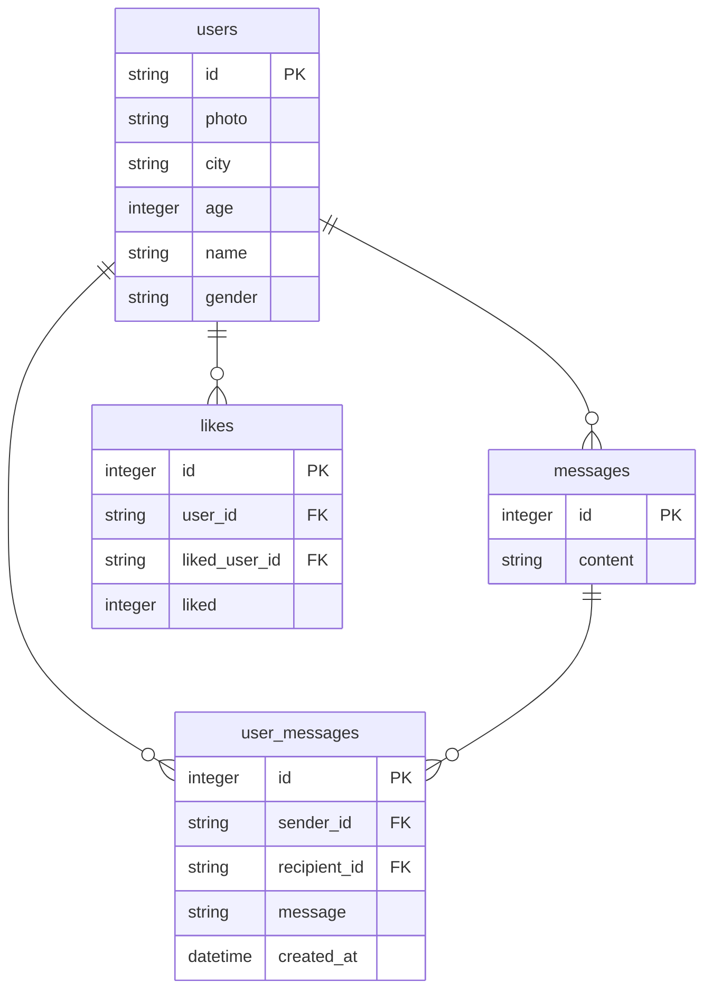

# API Chat va Chat vient

API de l'application **Chat va Chat vient**, un site de rencontres pour les chats.

## Prérequis

- Node.js (version minimale : 20)
- npm (généralement inclus avec Node.js)
- (optionnel) Docker et Docker Compose (pour exécuter avec Docker)

## Installation

1. Clonez le dépôt :  
   **Via SSH :**

   ```bash
   git clone git@github.com:Chat-va-chat-vient/API.git chat-va-chat-vient-api
   cd chat-va-chat-vient-api
   ```

   **Via HTTPS :**

   ```bash
    git clone https://github.com/Chat-va-chat-vient/API.git
    cd chat-va-chat-vient-api
   ```

2. Installez les dépendances :

   ```bash
   npm install
   ```

## Lancer l'API

### Avec Docker

1. **Construisez l'image Docker :**

   ```bash
   docker build -t chat-va-chat-vient-api .
   ```

2. **Exécutez le conteneur :**

   ```bash
   docker run -p 3000:3000 chat-va-chat-vient-api
   ```

### Avec Docker Compose (recommandé)

1. **Lancez le service avec Docker Compose :**

   ```bash
   docker-compose up --build
   ```

### Avec npm

1. **Assurez-vous d'avoir installé Node.js et npm.**

2. **Démarrez l'application :**

   ```bash
   npm install
   node server.js
   ```

3. **Accédez à l'API :**

   Ouvrez votre navigateur et allez à `http://localhost:3000`. La documentation Swagger est accessible à `http://localhost:3000/api-docs`.

## Schéma de la Base de Données


